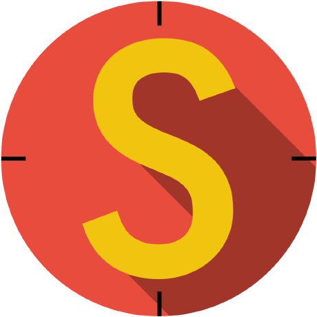

# Hi there! 👋

I'm confident you'll find a wealth of interesting things here! 😉

## About me

👨‍💻 My name is <strong><u>Maksym Hevyk</u></strong>. I am a junior Frontend/Fullstack developer

I am motivated, hardworking and receptive problem-solver with attention to detail. I am not afraid of challenging tasks and at the same time I always think of the most optimal solutions to solve the business problem. I like to communicate with people and help them if they need to

## Technology stack

  

    
Key technologies

    
  

  

    
Design solutions

    
  

  

    
Tools

    
  

  

    
Testing

    

      
      

        
      

      
    

  

  

    
Backend

    
  

  

    
Other

    

    
      

        
      

      
    

  

